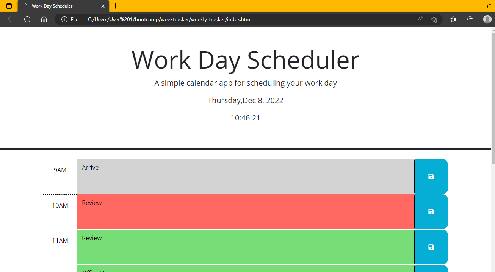

# Weekly Tracker

## [Deployed Application]()

## Description
A weekly work-day task tracker that saves what you input last using local storage.
## Installation
N/A

## Usage
This week we refactored code to add functionality to an already existing webpage. With the information given, our goal was to add current time and date (using DayJs) so the user knows what day it is. Also on the page is a form with a button. We had to make that button save information into local storage so when page is refreshed it leaves whatever was last saved and inputted into the form. Using Jquery we established a framework of "Past, Present, Future".

## Credits
Collaborators: Sha/Suzy Chambers

## License
Please refer to the LICENSE in the repo.  